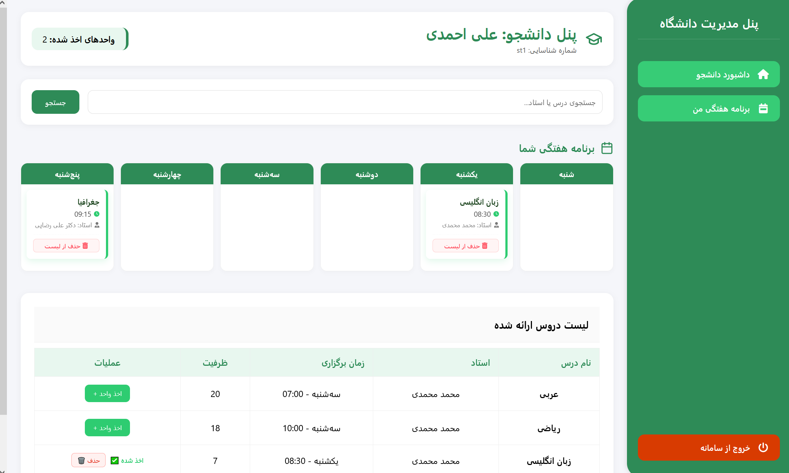

# 🎓 University Enrollment System


<p align="center">
  
</p>

The **University Enrollment System** is a **secure, role-based web platform** designed to manage the complete university course registration workflow.  
The project is built with a strong emphasis on **Clean Architecture**, **SOLID principles**, and **robust validation logic**.

It serves as an excellent **academic project**, **portfolio showcase**, and a solid base for real-world university systems.

---

## 📌 Project Overview

This system provides a comprehensive solution for managing course enrollment in a university environment.

It supports three main roles:

- 👨‍💼 **Administrator**
- 🎓 **Student**
- 👨‍🏫 **Professor**

Each role has clearly defined permissions and responsibilities, enforced through **Role-Based Access Control (RBAC)**.

---

## 🧠 Technology Stack

### Backend
- Python 3.10+
- Django 5.x / 6.x
- Django REST Framework (DRF)
- JWT Authentication (`djangorestframework-simplejwt`)

### Database
- SQLite (development & academic use)

### Frontend
- HTML5
- CSS3 (RTL support)
- FontAwesome 6

### Architecture
- Modular App-Based Architecture
- Clean Code & SOLID Principles
- Role-Based Access Control (RBAC)

---

## ✨ Features

### 👨‍💼 Administrator Panel

- **Course Management (CRUD)**
  - Create, update, and delete courses
- **Prerequisite Management**
  - Define prerequisite relationships between courses
- **Academic Rules**
  - Configure minimum & maximum semester credit limits

---

### 🎓 Student Panel

- **Smart Course Search**
  - Search by course title or professor name
- **Advanced Enrollment Validation**
  - Automatic checks for:
    - Time conflicts
    - Prerequisites
    - Course capacity
    - Duplicate enrollment
    - Credit limits
- **Weekly Schedule View**
  - Visual 5-day timetable
- **Course Management**
  - Drop courses during the active semester

---

### 👨‍🏫 Professor Panel

- **Assigned Courses Dashboard**
- **Student List Management**
  - View enrolled students sorted by last name
- **Professor Permissions**
  - Remove students from courses

---

## 🚀 Installation & Execution

### 1️⃣ Navigate to project directory

```bash
cd university_project
```

---

### 2️⃣ Install dependencies

```bash
pip install django djangorestframework djangorestframework-simplejwt django-filter
```

---

### 3️⃣ Apply migrations

```bash
python manage.py makemigrations
python manage.py migrate
```

---

### 4️⃣ Create admin user

```bash
python manage.py createsuperuser
```

---

### 5️⃣ Run development server

```bash
python manage.py runserver
```

Access the application at:

```
http://127.0.0.1:8000/
```

---

## 🧪 Running Tests

To validate enrollment logic:

```bash
python manage.py test apps.students
```

---

## 📂 Project Structure

```plaintext
university_project/
│
├── apps/
│   ├── accounts/      # Authentication & user roles
│   ├── courses/       # Course & prerequisite management
│   ├── students/      # Enrollment logic & schedules
│   └── professors/    # Professor dashboards
│
├── static/            # CSS, icons, fonts
├── templates/         # HTML templates (RTL supported)
└── manage.py
```

---

## 🔐 Security Features

- JWT-based authentication
- Role-based authorization
- Secure API endpoints
- Server-side validation for all enrollment rules

---

## 📝 Notes

- SQLite is used for simplicity and academic purposes
- Easily extendable to PostgreSQL or MySQL
- Designed for educational and demonstration use

---

## 📄 License

This project is intended for **educational and academic purposes**.

---

## 👤 Author

**Mohammad Salkhorde** 👋  
Python / Django Backend Developer  

Academic & Portfolio Project — focused on **Clean Architecture**, **SOLID principles**, and **secure role-based systems**.

- **GitHub:** https://github.com/MohammadSalkhorde  
- **LinkedIn:** https://www.linkedin.com/in/mohammad-salkhorde-a13767385  
- **Portfolio:** https://mohammad-salkhorde.ir  
- **Email:** m.salkhorde444@gmail.com
